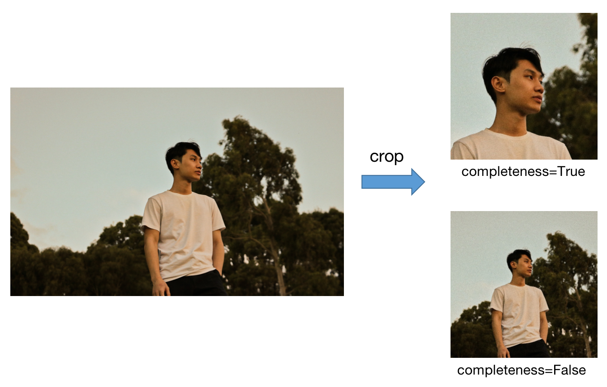

# cropimage
This is a simple toolkit for cropping main body from pictures.

# Installation
~~~sh
pip install cropimage
~~~

## Get Started
~~~python
from cropimage import Cropper

cropper = Cropper()

# Get a Numpy array of the cropped image
cropped_array = cropper.crop('./images/input.jpg')

# Save the cropped image
cv2.imwrite('cropped.jpg', result)
~~~

## Contributing
If you find any issue of this project, feel free to open an issue or contribute!
